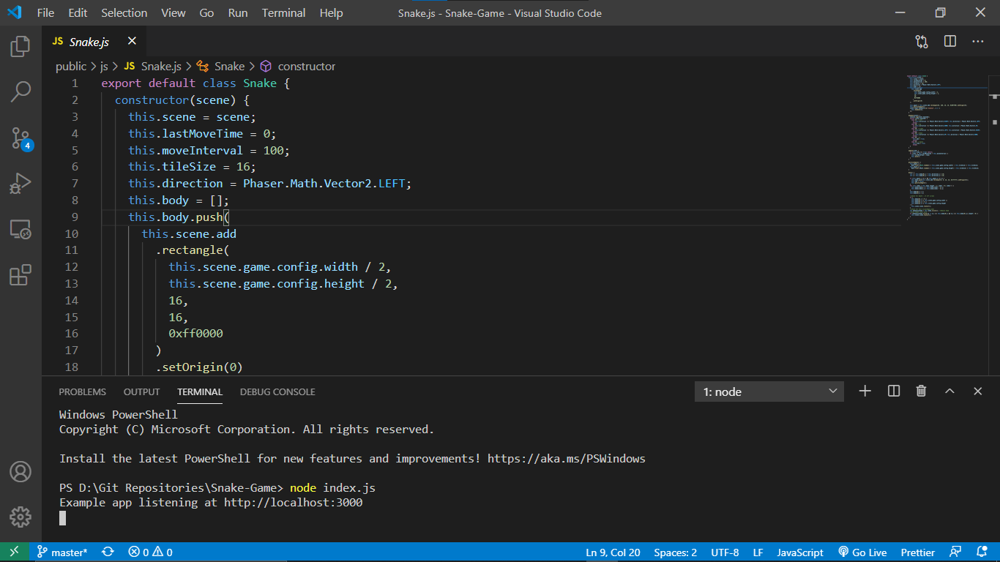
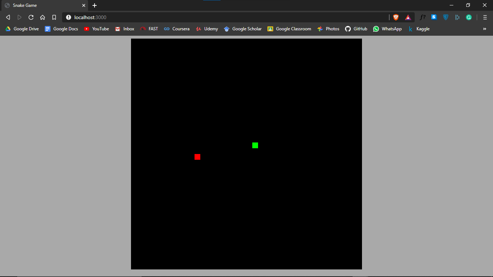
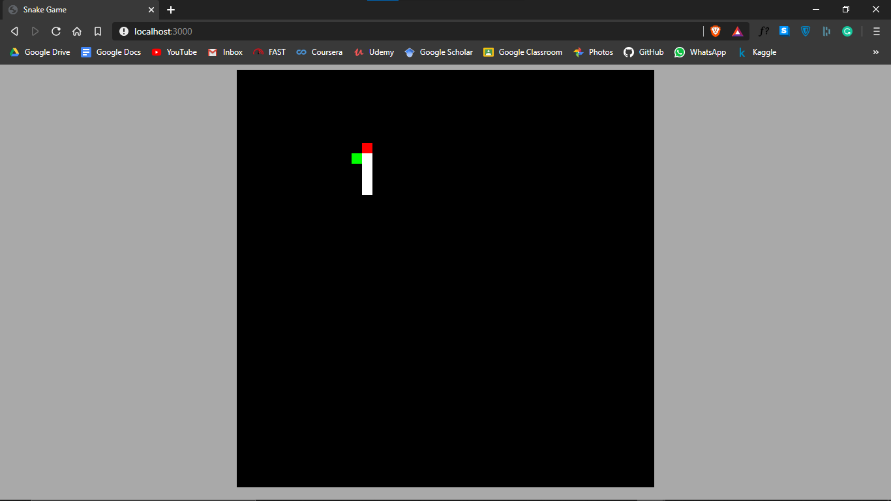

# Snake Game


<br>
<br>
<br>
<br>

#### The snake game is one of my favourite games when I used to grow up and still is, so I wanted to replicate the entire game using JavaScript. The game is designed in such a way that the user has move the snake using the arrow keys ➡⬆⬅⬇.  The snake head is denoted by a red square and when eating an apple which is green in color, grows it's tail long. When playing there are only few rules: never hit the snake's tail with it's head, and also don't hit the snake's head on to the wall.

------

## <u>Prerequisites 💻</u>

1. #### Node JS

   - #### To download Node JS, click on this link: https://nodejs.org/en/download/

   - #### After installing Node JS cross check whether you have successfully downloaded, to do that open your terminal and type in the following command:

     ```
     node -v
     ```

     #### This will display the version of your Node JS (v 12.17.1 or above)

2. #### NPM

   - #### NPM is a package manager and is already downloaded along with the Node JS that you have done before

   - #### To confirm that you have installed NPM, type in the following command in the terminal:

     ```
     npm -v
     ```

   - #### To update NPM to the latest version, type in the following command in the terminal:

     ```
     npm install npm@latest -g
     ```

     *Once you have done that you are good to go*

------


## <u>Play the Game 🎮</u>

#### To play the game you will have to clone this repository. Once you have done that, open the directory / folder with your code editor to make any changes (if you wish). Open your terminal and direct the path to the cloned repository in your local drive. Enter the following command into the terminal to run the game:

```
node index.js
```



####  Once you have done that, open your web browser and type in the following link: **http://localhost:3000**. The game will then start and will look something like this:



#### Navigate the game using your arrow keys and the snake will grow it's tail and that's denoted by each white boxes: 



------


## <u>Collaborator 👨‍💻</u>

#### [Santo Santhosh](https://github.com/santomat-5111)
